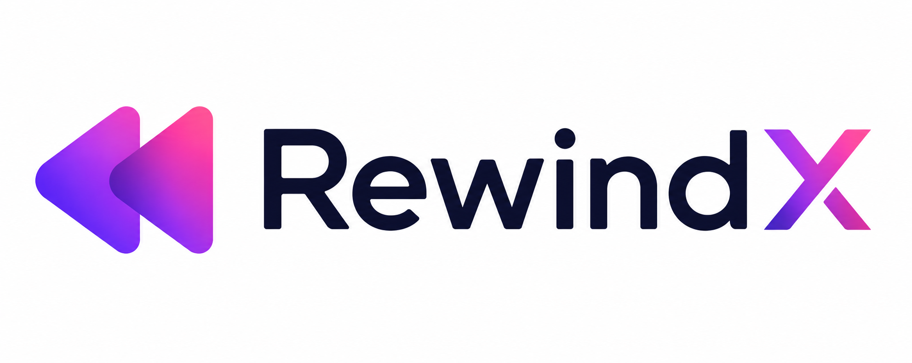

<div align="center">



<br />
<br />

**The AI-Powered Second Brain for Your Computer**

RewindX continuously understands your computer activity and turns it into searchable knowledge.

<br />

[](https://github.com/chetanupare/rewind/releases)
[](LICENSE)
[](https://www.typescriptlang.org)
[](https://electronjs.org)
[](https://react.dev)
[](https://sqlite.org)
[](https://ollama.com)

<br />

[](https://github.com/chetanupare/rewind/stargazers)
[](https://github.com/chetanupare/rewind/issues)
[](https://github.com/chetanupare/rewind/network/members)

</div>

<br />

---

## Ask RewindX

<table>
<tr>
<td width="50%">

**Find Anything**

"What was I debugging yesterday?"

"Where did I first see this error?"

"Find the commit related to this screenshot."

"Show every discussion about OAuth."

</td>
<td width="50%">

**Understand Work**

"Continue my work from Friday."

"Why did I switch to SQLite?"

"Summarize today's work."

"What have I learned this week?"

</td>
</tr>
</table>

RewindX does not just search. It remembers, reasons, and connects.

---

## Why RewindX

<table>
<tr>
<th>Feature</th>
<th>RewindX</th>
<th>Windows Recall</th>
<th>Rewind</th>
</tr>
<tr>
<td>100% Local</td>
<td align="center"><b>Yes</b></td>
<td align="center">Cloud</td>
<td align="center">Cloud</td>
</tr>
<tr>
<td>Open Source</td>
<td align="center"><b>Yes</b></td>
<td align="center">No</td>
<td align="center">No</td>
</tr>
<tr>
<td>Knowledge Graph</td>
<td align="center"><b>Yes</b></td>
<td align="center">No</td>
<td align="center">No</td>
</tr>
<tr>
<td>Developer Intelligence</td>
<td align="center"><b>Yes</b></td>
<td align="center">No</td>
<td align="center">No</td>
</tr>
<tr>
<td>Cognitive Memory</td>
<td align="center"><b>Yes</b></td>
<td align="center">No</td>
<td align="center">No</td>
</tr>
<tr>
<td>Decision Tracking</td>
<td align="center"><b>Yes</b></td>
<td align="center">No</td>
<td align="center">No</td>
</tr>
<tr>
<td>AI Reflection</td>
<td align="center"><b>Yes</b></td>
<td align="center">No</td>
<td align="center">No</td>
</tr>
<tr>
<td>Free Forever</td>
<td align="center"><b>Yes</b></td>
<td align="center">No</td>
<td align="center">No</td>
</tr>
</table>

---

## How It Works

```
Collectors → Brain → Knowledge → Answers
```

**Observe** — Tracks windows, keyboard, screenshots, git, browser  
**Understand** — Detects coding, debugging, meetings, research  
**Connect** — Links related events into episodes  
**Learn** — Builds knowledge graph over time  
**Predict** — Anticipates what you need next  
**Remember** — Stores knowledge, not raw data  

---

## Quick Start

### Step 1: Install Ollama

Download from [ollama.com/download](https://ollama.com/download)

```bash
ollama pull qwen2.5-vl:3b
ollama pull qwen2.5-coder:3b
ollama pull nomic-embed-text
```

### Step 2: Install RewindX

Download `RewindX-Setup-0.3.0.exe` from [Releases](https://github.com/chetanupare/rewind/releases)

### Step 3: Start Using

Press `Alt+Space` to open quick search and start asking questions.

---

## Features

<table>
<tr>
<td width="50%">

**Smart Memory**
- Episodic memory (remembers episodes, not events)
- Decision tracking (remembers why)
- Mistake learning (personal error database)
- Knowledge gaps (suggests what to learn)

**Focus & Productivity**
- Focus mode (Pomodoro timer)
- Smart notifications
- Focus analytics
- Distraction detection

</td>
<td width="50%">

**Intelligence**
- Vision AI (screenshot analysis)
- Meeting detection
- Session detection
- Pattern learning

**Integration**
- Git tracking
- Browser tracking
- Terminal capture
- Clipboard history

</td>
</tr>
</table>

---

## Performance

| Metric | Value |
|--------|-------|
| CPU | Less than 5% |
| RAM | Less than 300 MB |
| Startup | Less than 2 seconds |
| Search | Less than 100ms |
| Window Tracking | Less than 5ms |

---

## Design Principles

- **Privacy First** — All data stays on your machine
- **Local First** — Works completely offline
- **Evidence First** — Every answer is backed by data
- **Composable** — Plugin architecture
- **Event Driven** — Easy to debug and extend

---

## Architecture

```
Collectors          Brain              Memory
    │                 │                  │
    ▼                 ▼                  ▼
┌─────────┐    ┌───────────┐    ┌──────────────┐
│ Windows │    │ Intent    │    │ Episodes     │
│ Input   │───▶│ Patterns  │───▶│ Decisions    │
│ Git     │    │ Concepts  │    │ Knowledge    │
│ Browser │    │ Predict   │    │ Graph        │
└─────────┘    └───────────┘    └──────────────┘
                                      │
                                      ▼
                               ┌──────────────┐
                               │ Search       │
                               │ Chat         │
                               │ API          │
                               └──────────────┘
```

---

## Documentation

| Document | Description |
|----------|-------------|
| [Features](FEATURES.md) | What you can do with RewindX |
| [Architecture](ARCHITECTURE.md) | How the system works |
| [Brain](BRAIN.md) | The cognitive engine |
| [Roadmap](ROADMAP.md) | What is coming next |
| [Contributing](CONTRIBUTING.md) | How to help build |

---

## Road to v1.0

| Milestone | Goal |
|-----------|------|
| 100 Stars | Plugin SDK |
| 500 Stars | Linux Support |
| 1000 Stars | macOS Support |
| 5000 Stars | Mobile Companion |

---

## Community

[](https://github.com/chetanupare/rewind/issues)
[](https://github.com/chetanupare/rewind/discussions)
[](https://github.com/chetanupare/rewind/pulls)

---

## License

AGPL-3.0 — See [LICENSE](LICENSE) for details.

<br />

---

<div align="center">

**[Download](https://github.com/chetanupare/rewind/releases)** | **[Documentation](FEATURES.md)** | **[Contribute](CONTRIBUTING.md)**

<br />

Made by **[Chetan Upare](https://github.com/chetanupare)**

</div>
